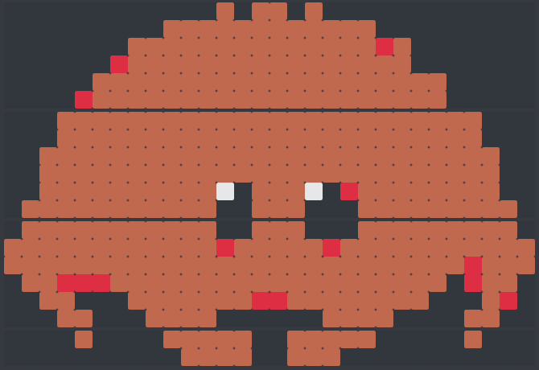

# EmojiPix
This is a simple command-line utility (and Rust crate!) for converting from a conventional image file (e.g. a PNG file) into a pixel-art version constructed with emoji.
One good use for this might be making pixel art in Discord, in posts or in your own profile.
For example, if you use `emoji_pix ferris.png --width 30` on the Ferris (Rust's mascot) picture downloaded [from here](https://rustacean.net/assets/rustacean-flat-noshadow.png), and paste the output into Discord (over several messages), it will look like this:

## CLI Installation and Usage

1. Make sure [Rust is installed](https://www.rust-lang.org/tools/install)
2. Run `cargo install emoji_pix`
3. Run the binary using `emoji_pix [options]`. For example, `emoji_pix ferris.png --width 30`.

The full CLI options are obtained using `emoji_pix --help`.

## Rust Crate Usage

1. Install the crate by adding `emoji_pix = "0.1.0"` to your `Cargo.toml`
2. Refer to the [documentation here](https://docs.rs/crate/emoji_pix/latest)

## Usage Tips

* If your source image has a transparent background, try editing the image and replacing the background with a solid colour that isn't already in the image. This is because transparency gets automatically converted to black, which may not give you good contrast for your image.
* For reasons explain below, the resulting "pictures" will look best on platforms that use Twemoji, such as Twitter and Discord.
* On discord, messages can only be 2000 characters long at most. What this means is that you'll often have to split up the large pictures over several messages, but this still looks good, as demonstrated by the above example.
* On some other platforms, putting the pixel art inside a monospaced font or `code` block will generally give a more pleasing result.

## How it Works

The emoji standard has 9 rectangle boxes of different colours: 🟥 🟧 🟨 🟩 🟦 🟪 🟫 ⬛ ⬜. They can be used as pseudo pixels in pixel art.
Because the emoji standard doesn't specify a particular shade of colour for each box, EmojiPix currently works under the assumption that you are using [Twemoji](https://github.com/twitter/twemoji). 
Certain applications such as Twitter and Discord use these emoji implementations.

EmojiPix then:

1. Resizes the image according to the user's input, maintaining the correct aspect ratio
2. For each pixel, finds the most similarly coloured emoji, using the [CIEDE2000](https://en.wikipedia.org/wiki/Color_difference#CIEDE2000) colour distance algorithm, and prints it.

## Future Directions

* [ ] Automated binary builds, meaning that you don't have to have Rust installed to use this.
* [ ] Customizable emoji set, to remove the assumption you are using Twemoji. This would allow you to get more accurate images on platforms that aren't using Twemoji. The emoji set would then be provided as a flag on the command-line.
* [ ] Allow reading the image from memory, rather than requiring a file path.
* [ ] Compile for WASM and make this into a web app
